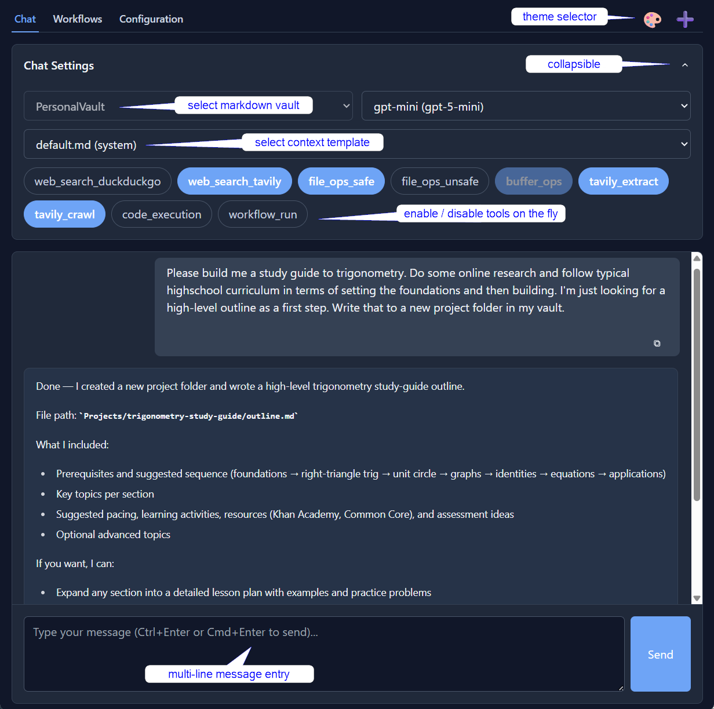

# AssistantMD

**An experimental agent harness and chat UI for control freaks.**

You compose behaviour directly through markdown templates:   
scheduled workflows | context curation | control directives | substitution patterns | buffer variables

## Design philosophy

**Data ownership:** Wherever possible, AssistantMD uses markdown files so data remains accessible and can be version controlled. For functionality requiring a database, SQLite maintains the file-first approach. Even chat sessions are automatically saved as markdown in your vault.

**Explicit / minimal magic:** Every instruction and step is explicitly declared in markdown templates. Defaults and implicit behaviour are kept to a minimum. This makes control templates a bit verbose, but also very flexible and traceable.

**Security:** The focus is safe, local automation on your markdown files. Prompt‑injection is a core concern, so AssistantMD takes a very cautious approach to accessing public, untrusted data and APIs. MCP and broader integrations are intentionally deferred until stronger sanitization for untrusted inputs exists.

## Requirements

- Docker Engine or Docker Desktop
- At least one LLM API key
- Comfort with the terminal

## ✨ Features

Designed to work alongside Obsidian or other markdown editors.

**🧑‍🏫 NEW: Context Manager**
- Steer your chat sessions by curating message history and passing custom system instructions
- Define context using markdown templates in `AssistantMD/ContextTemplates`

**👷‍♂️ Scheduled Workflows**
- Multi-step, scheduled workflows. Each step can define prompt, model, tools and content routing.
- Define workflows using markdown templates in `AssistantMD/Workflows/`

**💬 Chat Interface**
- Full access to your markdown notes
- Chat sessions saved as markdown

**🤖 AI Providers**
- GPT, Claude, Gemini, Mistral, Grok
- Any OpenAI-compatible API (Ollama, etc.)

**🔐 Privacy & Control**
- Self-hosted, single-user design
- Docker-based deployment

## 📚 Documentation

- **[Installation Guide](docs/setup/installation.md)**
- **[Basic Usage](docs/use/overview.md)**
- **[Context Manager](docs/use/context_manager.md)**
- **[Workflows](docs/use/workflows.md)**
- **[Security Considerations](docs/setup/security.md)**
- **[Upgrading](docs/setup/upgrading.md)**

## 📄 License

This project is licensed under the MIT License - see the [LICENSE](LICENSE) file for details.
