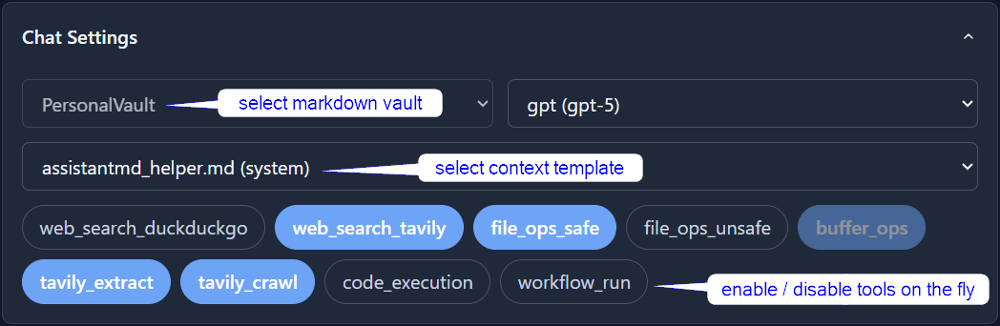
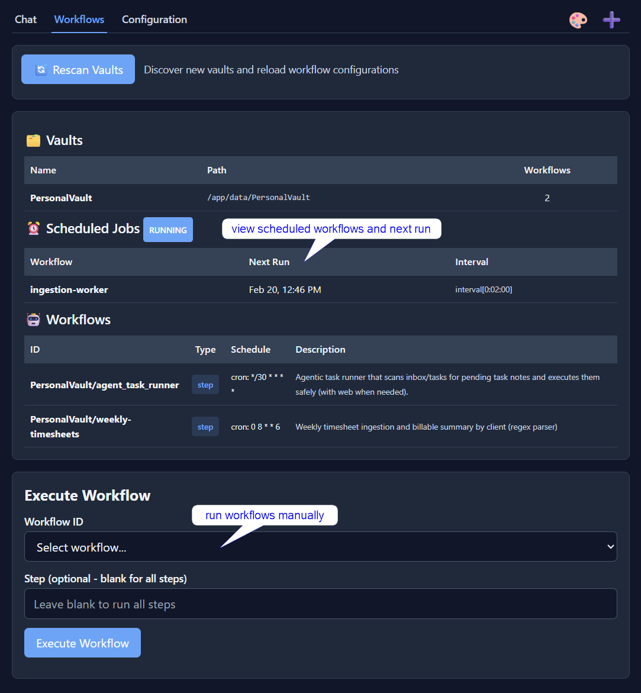

# AssistantMD

AssistantMD is a **markdown-native chat UI** and **agent harness** for automating research and knowledge workflows. It works alongside Obsidian (or any markdown editor) so you retain **full control of your data**: chats, templates and many automation outputs are saved as plain markdown that you can inspect and version control.

> **Security note:** AssistantMD has **no built-in auth or TLS**. Run it on a trusted network and/or add your own security layers. See [docs/setup/security.md](docs/setup/security.md).

## Why AssistantMD

- **File-first ownership:** Markdown wherever possible; SQLite only when a database is required.
- **Composable behaviour:** Define instructions, tool access, routing and multi-step logic in templates. Adapt the system to how you want to work.
- **Cautious automation:** Built with prompt-injection awareness and a conservative stance toward untrusted content.

## How it works (mental model)

When you run AssistantMD, it adds an `AssistantMD/` folder to each mounted vault:

- `AssistantMD/Chat_Sessions/` - chat transcripts
- `AssistantMD/ContextTemplates/` - context templates
- `AssistantMD/Workflows/` - scheduled / multi-step workflows
- `AssistantMD/Import/` - drop PDFs to import to markdown

### Define behaviour in templates

Templates are plain markdown files that live inside your vault. Behaviour is composed using control primitives (plain text syntax) such as yaml frontmatter, @directives and substitution patterns. For example:

- `schedule: "cron: 10 0 * * *"` - schedules a workflow template
- `@input` / `@output` - pull from or write to files and in-memory variables (buffers)
- `@tools` - enable tools per step (web search, file ops, extract/crawl, workflow runner)
- `@model` - choose a model per step
- `{today}` or `{this-week}` - read or write files based on date

See a [lightweight chat memory implementation](docs/examples/ContextTemplates/weekly-memory.md?plain=1) in the example library.  

## Typical use cases

### Deep research in the chat UI
Give AssistantMD a research goal and let it run: **search**, **open pages**, **extract details**, and keep digging via follow-up queries. When you’re ready, have it write a synthesis report into your vault.

### Project-aware chat (context templates)
Stop repeating yourself. Set up a focused working set (notes, summaries, reporting templates, etc.) for your projects so you can jump into new chats quickly.

### Scheduled workflows for planning and follow-through
Run multi-step workflows on a schedule to keep notes and plans up to date (e.g. every morning, scan new notes and copy actions and follow-ups into a master task list).

 

 

 

## Features

**📥 Import pipeline**
- Import PDFs and URLs into markdown and build a searchable research library in your vault.
- Keep source material in plain text for downstream workflows and chat.

**👷‍♂️ Scheduled workflows**
- Multi-step, scheduled workflows with per-step prompts, models, tools, and output routing.
- Workflow templates live in `AssistantMD/Workflows/`.

**💬 Context manager**
- Steer your chat sessions using markdown templates. From simple custom instructions to multi-step context assembly.
- Context templates live in `AssistantMD/ContextTemplates/`.

**🔐 Plain-text ownership & control**
- Self-hosted, single-user design with markdown-first storage.
- Docker-based deployment, with data remaining local and inspectable.

**🤖 Multiple AI providers**
- GPT, Claude, Gemini, Mistral, Grok
- Any OpenAI-compatible API (e.g. Ollama)

## Documentation

- **[Installation Guide](docs/setup/installation.md)**
- **[Basic Usage](docs/use/README.md)**
- **[Context Manager](docs/use/context_manager.md)**
- **[Workflows](docs/use/workflows.md)**
- **[Reference](docs/use/reference.md)**
- **[Security Considerations](docs/setup/security.md)**
- **[Upgrading](docs/setup/upgrading.md)**

## Requirements

- Docker Engine or Docker Desktop
- At least one LLM API key (OpenAI / Anthropic / Google / etc.) or an OpenAI-compatible API endpoint
- Comfort with the terminal

## License

MIT — see [LICENSE](LICENSE).

## Attributions

Some design ideas in AssistantMD were shaped by the work of others:

- **RLM-style research loops**: https://alexzhang13.github.io/blog/2025/rlm/
- **Context engineering for long-running agents**: summary notes in this repo ([docs/use/context_manager.md](docs/use/context_manager.md)), covering themes from Google, Anthropic, Stanford/SambaNova ACE, and Manus.
- Third-party software notices: see [THIRD_PARTY_NOTICES.md](THIRD_PARTY_NOTICES.md).
